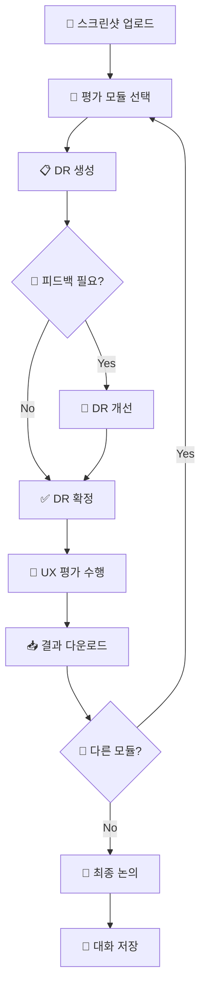

# [SNU x CXI] Mobile App UX Evaluation System

<div align="center">

[](https://python.org)
[](https://gradio.app)
[](https://openai.com)

**AI 기반 모바일 앱 UX 평가 시스템**

</div>

---

## 📋 목차

- [🎯 시스템 개요](#-시스템-개요)
- [🚀 빠른 시작](#-빠른-시작)
  - [🌐 Hugging Face Spaces (권장)](#-hugging-face-spaces-권장)
  - [💻 로컬 환경 설치](#-로컬-환경-설치)
- [💡 사용 방법](#-사용-방법)
- [🔧 시스템 구성](#-시스템-구성)
- [📊 평가 모듈](#-평가-모듈)
- [🔬 기술 스택](#-기술-스택)
- [🛠️ 문제 해결](#️-문제-해결)

---

## 🎯 시스템 개요

**[SNU x CXI] Mobile App UX Evaluation System**은 서울대학교와 CXI가 공동 개발한 AI 기반 UX 평가 도구입니다. 모바일 앱 스크린샷을 업로드하면 4가지 전문 영역에서 UX 문제점을 자동으로 분석하고 개선 방안을 제시합니다.

### ✨ 주요 특징

- **🤖 AI 기반 분석**: GPT-4o 멀티모달 모델 활용
- **4️⃣ 전문 평가 모듈**: Text Legibility, Information Architecture, Icon Representativeness, User Task Suitability
- **💬 대화형 분석**: AI와 실시간 대화를 통한 맞춤형 개선 방안 도출
- **📱 모바일 특화**: 모바일 앱 UX에 최적화된 평가 기준
- **🔒 보안**: API 키 자동 정리 및 세션 관리
- **☁️ 클라우드 지원**: Hugging Face Spaces에서 즉시 사용 가능

---

## 🚀 빠른 시작

### 🌐 Hugging Face Spaces (권장)

별도 설치 없이 바로 사용할 수 있습니다:

1. **🔗 접속**: [Hugging Face Spaces](https://huggingface.co/spaces/dusanisbaek/snu-cxi-ux-eval)
2. **🔑 API 키 입력**: OpenAI API 키를 입력하세요
3. **📱 스크린샷 업로드**: 분석할 모바일 앱 화면을 업로드
4. **🎯 평가 시작**: 원하는 평가 모듈을 선택하고 분석 시작

> **💡 장점**: 설치 불필요, 자동 업데이트, 어디서나 접근 가능

### 💻 로컬 환경 설치

개발이나 커스터마이징이 필요한 경우:

#### 1️⃣ 필수 요구사항
- **Python 3.8+**
- **OpenAI API 키** ([openai.com](https://openai.com)에서 발급)

#### 2️⃣ 설치 단계

```bash
# 1. 저장소 클론
git clone https://github.com/baekdusan/snu-cxi-ux-eval.git
cd snu-cxi-ux-eval

# 2. 가상환경 생성 (권장)
python -m venv venv
source venv/bin/activate  # Windows: venv\Scripts\activate

# 3. 의존성 설치
pip install -r requirements.txt

# 4. 실행
python app.py
```

#### 3️⃣ 접속
브라우저에서 `http://localhost:7860` 접속

---

## 💡 사용 방법

### 📋 단계별 가이드

#### **1단계: 시스템 설정**
- **API 키 입력**: 헤더의 OpenAI API Key 필드에 키 입력
- **모델 선택**: GPT-4o 또는 기타 모델 선택 (기본: GPT-4o)
- **시스템 상태 확인**: 좌측 상단의 📊 시스템 상태에서 인증 확인

#### **2단계: 이미지 업로드**
- **📱 스크린샷 업로드**: "이미지 업로드" 영역에 모바일 앱 화면 드래그 앤 드롭
- **🖼️ 프리뷰 확인**: 업로드된 이미지가 올바르게 표시되는지 확인
- **📊 상태 확인**: 시스템 상태에서 이미지 캐시 상태 확인

#### **3단계: 평가 모듈 선택**
4가지 전문 평가 모듈 중 선택:
- **Text Legibility**: 텍스트 가독성 평가
- **Information Architecture**: 정보 구조 분석
- **Icon Representativeness**: 아이콘 표현성 평가
- **User Task Suitability**: 사용자 작업 적합성 분석

#### **4단계: DR(Design Representation) 생성**
- **📋 DR 생성** 버튼 클릭
- AI가 스크린샷을 분석하여 구조화된 JSON 데이터 생성
- 필요시 💬 Feedback을 통해 DR 개선

#### **5단계: UX 평가 수행**
- **✅ DR 확정** 후 자동으로 평가 시작
- 선택한 모듈의 전문 기준으로 UX 문제점 분석
- 구체적인 개선 방안과 우선순위 제시

#### **6단계: 결과 다운로드**
- **📥 다운로드** 버튼으로 평가 결과 JSON 파일 저장
- 여러 모듈로 평가한 경우 모든 결과 수집

#### **7단계: 종합 분석 (Final Report)**
- **🚀 최종 평가 결과 논의 시작** 버튼 클릭
- AI와 대화를 통해 종합적인 개선 방안 논의
- 💾 대화 내용을 JSON 파일로 저장 가능

### 🎨 UI 구성 요소


---

## 🔧 시스템 구성

### 📁 프로젝트 구조

```
snu-cxi-ux-eval/
├── 📄 app.py                    # 메인 Gradio 애플리케이션
├── ⚙️ config.py                 # 설정 관리 (API, 모델)
├── 🛠️ utils.py                  # 유틸리티 함수
├── 📋 requirements.txt          # Python 의존성
├── 🤖 agents/                   # AI 에이전트 모듈
│   ├── dr_generator_agent.py    # DR 생성 에이전트
│   ├── evaluator_agent.py       # UX 평가 에이전트
│   └── final_report_agent.py    # 최종 리포트 에이전트
├── 🎨 ui/                       # UI 컴포넌트
│   ├── components.py            # Gradio 컴포넌트
│   ├── business_logic.py        # 비즈니스 로직
│   └── handlers.py              # 이벤트 핸들러
├── 📝 prompts/                  # AI 프롬프트
│   ├── prompt_loader.py         # 프롬프트 관리
│   └── Agent*_*.md              # 에이전트별 프롬프트 (8개)
└── 📚 references/               # 평가 기준 문서
    └── Agent*_*.md              # 휴리스틱 및 가이드라인
```

### 🔄 시스템 워크플로우



---

## 🔬 기술 스택

### 🧠 AI & ML
- **OpenAI GPT-4o+**: 멀티모달 AI 모델
- **OpenAI Response API**: 벡터 스토어 및 파일 관리

### 🌐 프론트엔드
- **Gradio 3.50.2**: 웹 UI 프레임워크
- **HTML/CSS**: 반응형 레이아웃
- **JavaScript**: 클라이언트 인터랙션

### ⚙️ 백엔드
- **Python 3.8+**: 메인 런타임
- **PIL (Pillow)**: 이미지 처리
- **JSON**: 구조화된 데이터 교환

### ☁️ 인프라
- **Hugging Face Spaces**: 클라우드 호스팅

---

## 🛠️ 문제 해결

### ❓ 자주 묻는 질문

#### **Q: API 키가 작동하지 않습니다**
- ✅ OpenAI API 키가 유효한지 확인
- ✅ 계정에 충분한 크레딧이 있는지 확인
- ✅ GPT-4o 모델 접근 권한 확인

#### **Q: 이미지 업로드가 실패합니다**
- ✅ 지원 형식 확인: PNG, JPG, JPEG, BMP, GIF
- ✅ 파일 크기 확인: 10MB 이하 권장
- ✅ 네트워크 연결 상태 확인

#### **Q: 분석 결과가 부정확합니다**
- ✅ 고해상도 스크린샷 사용 권장
- ✅ 전체 화면이 포함된 이미지 업로드 (최대 9장)
- ✅ 피드백을 통한 DR 개선 후 재분석

#### **Q: 시스템이 느립니다**
- ✅ 인터넷 연결 상태 확인
- ✅ 이미지 크기 최적화 (1-5MB 권장)
- ✅ 브라우저 캐시 정리
- ✅ gpt-4o 사용 권장 (해당 시스템은 gpt-4o에 최적화되어 있습니다.)

### 🔒 보안 및 개인정보

- **API 키 보안**: 2시간 자동 타임아웃, 앱 종료 시 자동 정리
- **이미지 처리**: 로컬 처리 후 OpenAI로 전송, 분석 후 서버에서 자동 삭제
- **데이터 저장**: Huggingface Space 사용 시 서버 컴퓨터에 저장되나, 제작자가 조회할 수 없음; 로컬 환경에서 실행시 데이터 유출 문제 전혀 없음

---

## 📄 라이선스 및 저작권

```
Copyright (c) 2024 Seoul National University & CXI
All rights reserved.

이 소프트웨어는 서울대학교와 CXI의 공동 연구 성과물입니다.
상업적 사용 시 사전 협의가 필요합니다.
```

---

<div align="center">

**🎯 Professional UX Analysis Made Simple**

*Powered by Seoul National University & CXI*

</div>